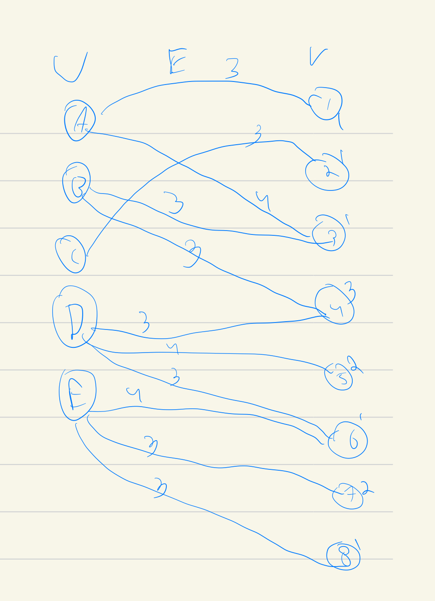

Calculate maximal cover.

# Pre-requisites
`cvc5` needs to be installed.
For most platforms:
```
pip install cvc5
```
For macOS with M* processors, get in touch for a workaround.

# Usage
```
python3 cover-bool.py <path to donors csv> <path to recipients csv> <path to edges csv> <bound on donors>
```


# Example
We consider the following input:



Nodes on the left are donors, nodes on the right are recipient profiles.
The number next to the recipient profile node is the number of recipients with that profile.
The number on an edge is a score for the match between the donor and the recipient.

The csv files that encode this graph are:
```
graph_nodes_donors.csv
graph_nodes_recipients.csv
graph_edges.csv
```


## Usage Examples
- maximum 4 donors:
```
$ python3 cover-bool.py graph_nodes_donors.csv graph_nodes_recipients.csv graph_edges.csv 4
chosen edges:  [('donor_D', 'recipient_4'), ('donor_D', 'recipient_5'), ('donor_E', 'recipient_8'), ('donor_E', 'recipient_6'), ('donor_C', 'recipient_2'), ('donor_E', 'recipient_7'), ('donor_A', 'recipient_1'), ('donor_A', 'recipient_3')]
maximal score:  40
```

- maximum 3 donors:
```
$ python3 cover-bool.py graph_nodes_donors.csv graph_nodes_recipients.csv graph_edges.csv 3
chosen edges:  [('donor_A', 'recipient_3'), ('donor_E', 'recipient_8'), ('donor_A', 'recipient_1'), ('donor_D', 'recipient_4'), ('donor_E', 'recipient_6'), ('donor_D', 'recipient_5'), ('donor_E', 'recipient_7')]
maximal score:  37
```

- maximum 2 donors:
```
$ python3 cover-bool.py graph_nodes_donors.csv graph_nodes_recipients.csv graph_edges.csv 2
chosen edges:  [('donor_D', 'recipient_4'), ('donor_D', 'recipient_5'), ('donor_E', 'recipient_8'), ('donor_E', 'recipient_7'), ('donor_E', 'recipient_6')]
maximal score:  30
```

- maximum 1 donor:
```
$ python3 cover-bool.py graph_nodes_donors.csv graph_nodes_recipients.csv graph_edges.csv 1
chosen edges:  [('donor_D', 'recipient_4'), ('donor_D', 'recipient_5'), ('donor_D', 'recipient_6')]
maximal score:  20
```

